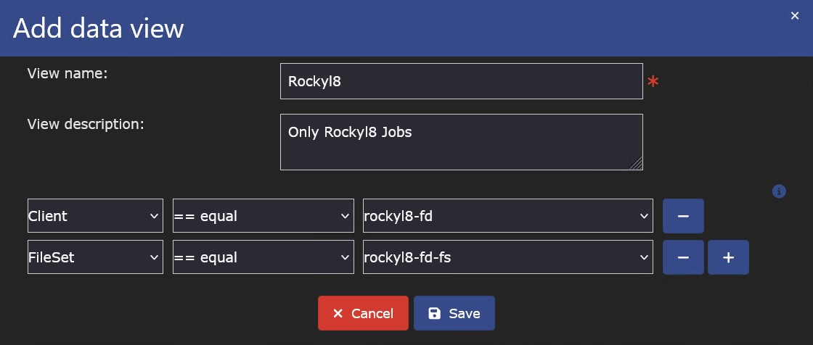
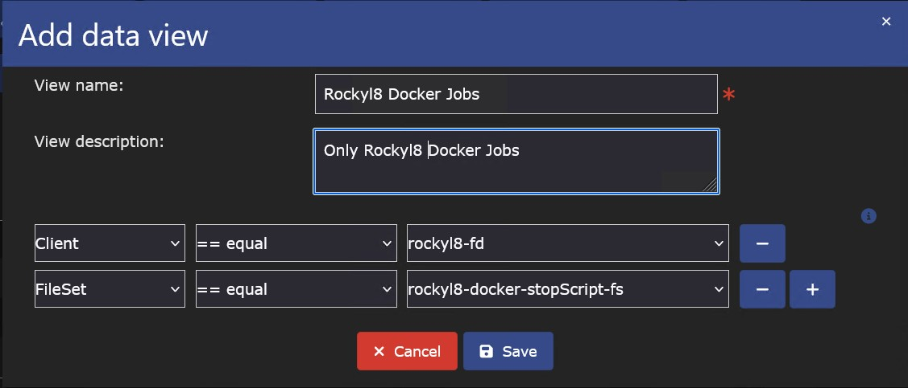
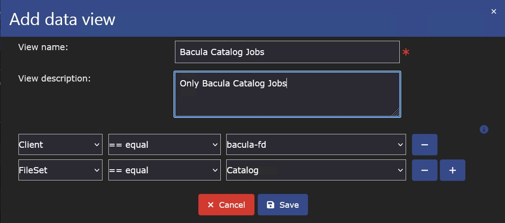

# Bacula - Enterprise Backup Solution

[`Bacula`][Bacula][^1]

[`Bacularis`][Bacularis][^2]

##### Einrichtung eigener Ansichten unter `Bacularis`

!!! info

    - Login auf der Bacularis Startseite
    - Jobs -> + Zeichen
    - Ausfüllen wie auf dem Bild Beispiel 1 - `Rockyl8 Jobs`  
    {width=600}

    - Ausfüllen wie auf dem Bild Beispiel 2 - `Rockyl8 Docker Jobs`  
    {width=600}

    - Ausfüllen wie auf dem Bild Beispiel 3 - `Bacula Catalog Jobs`  
    {width=600}

[^1]: [Bacula Homepage](https://www.bacula.org/){target=\_blank}
[^2]: [Bacularis Homepage](https://https://bacularis.app/){target=\_blank}
