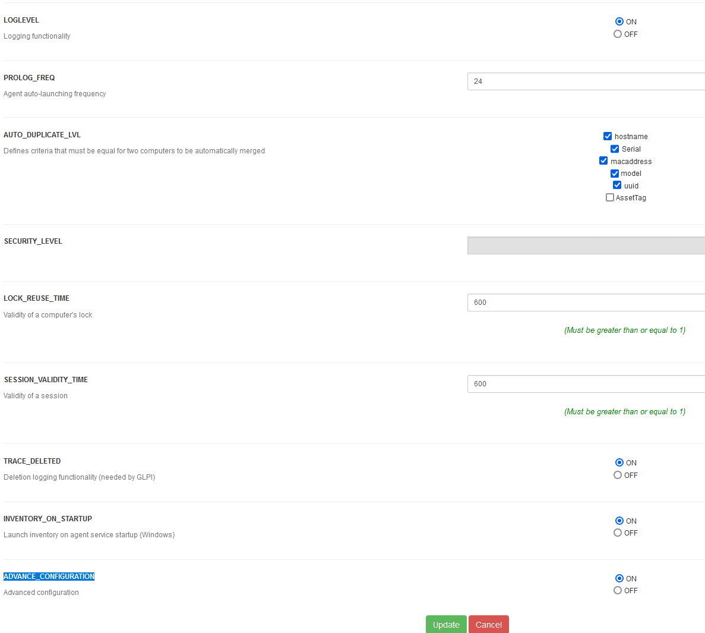
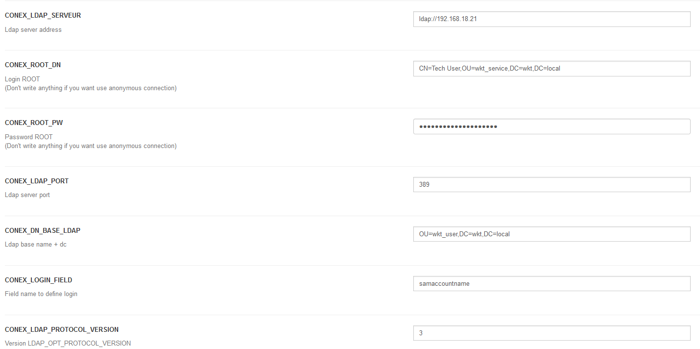
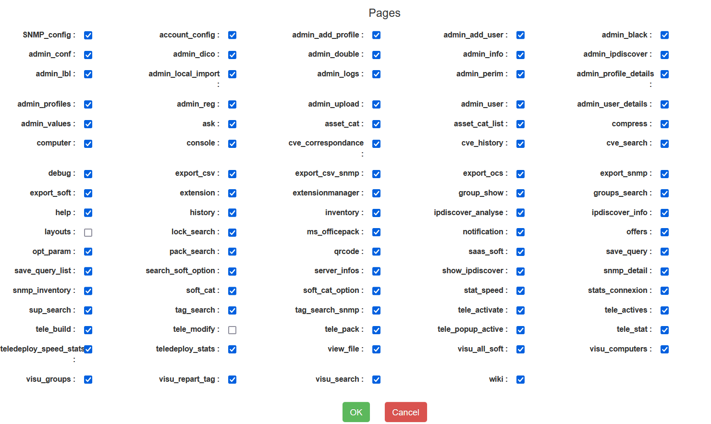
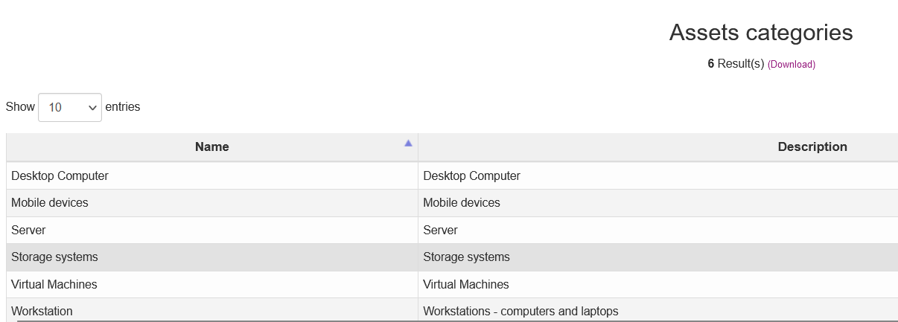
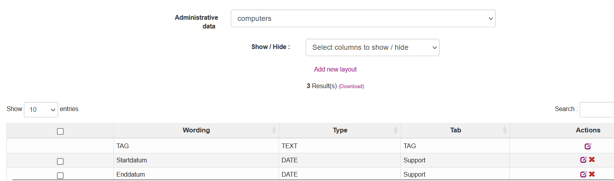
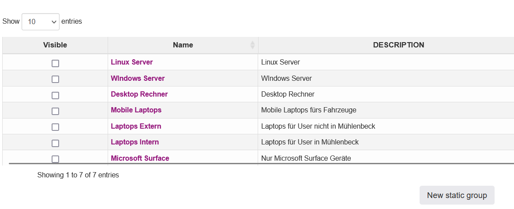

# OCS Inventory

!!! question "What is OCS Inventory?"

    :simple-traefikproxy: [`OCS Inventory`][OCS Inventory][^1] (Open Computers and Software Inventory Next Generation) is an assets management and deployment solution. Since 2001, OCS Inventory NG has been looking for making software and hardware more powerful. OCS Inventory NG asks its agents to know the software and hardware composition of every computer or server.

    [OCS Inventory]: https://ocsinventory-ng.org/?lang=en

[^1]: :material-wikipedia: [Wikipedia - OCS Inventory](https://de.wikipedia.org/wiki/OCS_Inventory_NG)
[^2]: :material-github: [Github - OCS Inventory](https://github.com/OCSInventory-NG/OCSInventory-ocsreports)
[^3]: :material-docker: [Docker OCS Inventory](https://hub.docker.com/repository/docker/johann8/alpine-ocs/general)

#### Algemeine Information

!!! note "Allgemeine Information über OCS Inventory"

     [`OCS Inventory`][OCS Inventory] ist sehr vielseitig. Man kann den Funktionsumfang mit Hilfe von [`Plugins`][Plugins] erweitern. The source code can be found on `Github`[^2].
    Für die Inventarisierung wird ein [`Windows Agent`][Windows Agent] [`Linux Agent`][Linux Agent] eingesetzt.
    Für OCS Inventory Anwendung habe ich ein `Docker Image` gebaut, sodass die Installation und das Update sehr schnell erfolgen können.
    Das Docker Image befindet sich auf dem `Docker Hub`[^3]. Der Link zum Docker Image: [`OCS Inventory Docker image`][OCS Inventory Docker image].
    [`Hier`][Hier] ist die Beschreibung wie man `GLPI` installiert und konfiguriert.

    [Plugins]: https://github.com/PluginsOCSInventory-NG
    [Windows Agent]: https://github.com/OCSInventory-NG/WindowsAgent
    [Linux Agent]: https://github.com/OCSInventory-NG/UnixAgent
    [OCS Inventory]: https://github.com/OCSInventory-NG/OCSInventory-ocsreports
    [OCS Inventory Docker image]: https://hub.docker.com/repository/docker/johann8/alpine-ocs/general
    [GLPI]: https://glpi-project.org
    [GLPI Docker Image]: https://hub.docker.com/repository/docker/johann8/alpine-glpi/general
    [Hier]: https://docs.int.wassermanngruppe.de/tutorials/docker/glpi/


## Install OCS Inventory as `docker container`

Jeder Container repräsentiert eine einzelne Anwendung, die in einem überbrückten (Bridged) Netzwerk verbunden sind:

<div class="grid cards" markdown>
   -  [__GLPI__](https://glpi-project.org/) IT Asset Management.
   -  [__OCS Inventory__](https://ocsinventory-ng.org/?lang=en) Open computers and software inventory.
   - :simple-mariadb: [__MariaDB__](https://mariadb.org/) Datenbank.
   - :simple-nginx: [__Nginx__](https://nginx.org/) Webserver für Komponenten des Stacks.
   - :fontawesome-solid-memory: [__Memcached__](https://www.memcached.org/) Distributed memory object caching system.
</div>

#### Bereiten Sie Ihr System vor

Bevor Sie `OCS Inventory` installieren, sollten Sie einige Voraussetzungen überprüfen:

!!! info
    - [`Docker`][Docker] Dienst muss auf dem Host installiert sein.
    - Traefik muss als `Docker Service` installiert sein.
    - [`MariaDB`][MariaDB] muss entweder als `Container` im gleichen `Docker Stack` laufen oder als extra `Docker Service` installiert sein.
    - Port `4443 TCP` muss auf dem `Docker Host` geöffnet werden, damit der OCS Inventory Agent eine Verbindung zum Server aufbauen kann.
    - Einen DNS-Record z.B. `ocs.myfirma.de` erstellen.

    [Docker]: ../dockerinstall/index.md
    [MariaDB]: ../mariadb/index.md


#### OCS Inventory installieren

??? tip "OCS Inventory unter `Rocky Linux | Oracle` einrichten"

    === "Create folders"

        ```bash
        DOCKERDIR=/opt/inventory
        mkdir -p ${DOCKERDIR}/data/ocsinventory/{perlcomdata,ocsreportsdata,varlibdata,httpdconfdata} 
        mkdir -p ${DOCKERDIR}/data/mariadb/{config,dbdata,socket}
        mkdir -p ${DOCKERDIR}/data/nginx/{config,certs,auth}
        chown -R 101:101 ${DOCKERDIR}/data/ocsinventory/perlcomdata/
        chown -R 101:101 ${DOCKERDIR}/data/ocsinventory/ocsreportsdata/
        chown -R 101:101 ${DOCKERDIR}/data/ocsinventory/varlibdata/
        cd ${DOCKERDIR}
        tree -d -L 5 ${DOCKERDIR}
        ```
    === "Download config files"

        ```bash
        DOCKERDIR=/opt/inventory
        cd ${DOCKERDIR}
        wget https://raw.githubusercontent.com/johann8/ocs-alpine/master/docker-compose.yml
        wget https://raw.githubusercontent.com/johann8/ocs-alpine/master/docker-compose.override.yml
        wget https://raw.githubusercontent.com/johann8/ocs-alpine/master/.env
        wget https://raw.githubusercontent.com/johann8/ocs-alpine/master/nginx/config/ocsinventory.conf.template
        mv ocsinventory.conf.template data/nginx/config
        cd ${DOCKERDIR}
        ```

    === "Set firewall rules"

        ```bash
        # Set firewall rules
        firewall-cmd --zone=public --add-port=4443/tcp --permanent
        firewall-cmd --reload
        firewall-cmd --zone=public --list-all
        ```

    === "NGINX create config file"

        ```bash
        DOCKERDIR=/opt/inventory
        cd ${DOCKERDIR}
        cat > data/nginx/config/ocsinventory.conf.template << 'EOL'
        ##
        # You should look at the following URL's in order to grasp a solid understanding
        # of Nginx configuration files in order to fully unleash the power of Nginx.
        # https://www.nginx.com/resources/wiki/start/
        # https://www.nginx.com/resources/wiki/start/topics/tutorials/config_pitfalls/
        # https://wiki.debian.org/Nginx/DirectoryStructure
        #
        # In most cases, administrators will remove this file from sites-enabled/ and
        # leave it as reference inside of sites-available where it will continue to be
        # updated by the nginx packaging team.
        #
        # This file will automatically load configuration files provided by other
        # applications, such as Drupal or Wordpress. These applications will be made
        # available underneath a path with that package name, such as /drupal8.
        #
        # Please see /usr/share/doc/nginx-doc/examples/ for more detailed examples.
        ##

        # OCS server configuration
        #
        server {
            listen ${LISTEN_PORT} ${PORT_TYPE} default_server;
        
            ssl_certificate /etc/nginx/certs/${SSL_CERT};
            ssl_certificate_key /etc/nginx/certs/${SSL_KEY};

            location / {
                proxy_redirect          off;
                proxy_set_header        X-Forwarded-Proto $scheme;
                proxy_set_header        Host              $http_host;
                proxy_set_header        X-Real-IP         $remote_addr;
                proxy_set_header        X-Forwarded-For   $proxy_add_x_forwarded_for;
                proxy_set_header        X-Frame-Options   SAMEORIGIN;
                proxy_pass              http://ocsapp;
            }

        #    location /ocsapi {
        #        auth_basic "OCS Api area";
        #        auth_basic_user_file /etc/nginx/auth/${API_AUTH_FILE};
        #        proxy_pass              http://ocsapp/ocsapi;
        #    }

            location /download {
                proxy_read_timeout      ${READ_TIMEOUT};
                proxy_connect_timeout   ${CONNECT_TIMEOUT};
                proxy_send_timeout      ${SEND_TIMEOUT};
                client_max_body_size    ${MAX_BODY_SIZE};
	        proxy_pass              http://ocsapp/download;
            }
        }
        EOL
        ```

    === "MariaDB create my.cnf"
        ```bash
        DOCKERDIR=/opt/inventory
        cd ${DOCKERDIR}
        cat > data/mariadb/config/my.cnf << 'EOL'
        [mysqld]
        default-time-zone              = 'Europe/Berlin'
        character-set-client-handshake = FALSE
        character-set-server           = utf8mb4
        collation-server               = utf8mb4_unicode_ci
        max_allowed_packet             = 192M
        max-connections                = 350
        key_buffer_size                = 0
        read_buffer_size               = 192K
        sort_buffer_size               = 2M
        innodb_buffer_pool_size        = 24M
        read_rnd_buffer_size           = 256K
        tmp_table_size                 = 24M
        performance_schema             = 0
        innodb-strict-mode             = 0
        thread_cache_size              = 8
        query_cache_type               = 0
        query_cache_size               = 0
        max_heap_table_size            = 48M
        thread_stack                   = 256K
        skip-host-cache
        log-warnings                   = 0
        event_scheduler                = 1

        [client]
        default-character-set          = utf8mb4

        [mysql]
        default-character-set          = utf8mb4
        EOL
        ```

#### OCS Inventory: Customise compose and config files

??? tip "OCS Inventory: Customise compose and config files"

    === "docker-compose.yml"

        ``` yaml
        ---
        networks:
          inventoryNet_frontend:
            driver: bridge
            driver_opts:
              com.docker.network.enable_ipv6: "false"
            ipam:
              driver: default
              config:
                - subnet: ${SUBNET_FRONTEND}.0/24
          inventoryNet_backend:
            driver: bridge
            driver_opts:
              com.docker.network.enable_ipv6: "false"
            internal: true
            ipam:
              driver: default
              config:
                - subnet: ${SUBNET_BACKEND}.0/24

        services:

          #
          ### === OCS Inventory Web APP ===
          #
          ocsapp:
            image: johann8/alpine-ocs:${VERSION_OCS}
            container_name : ocsapp
            restart: always
            #ports:                                # commented, if traefik is used
              #- ${PORT_OCS_EXT}:80                # commented, if traefik is used
          volumes:
            - "${DOCKERDIR}/data/ocsinventory/perlcomdata:/etc/ocsinventory-server"
            - "${DOCKERDIR}/data/ocsinventory/ocsreportsdata:/usr/share/ocsinventory-reports/ocsreports/extensions"
            - "${DOCKERDIR}/data/ocsinventory/varlibdata:/var/lib/ocsinventory-reports"
            - "${DOCKERDIR}/data/ocsinventory/httpdconfdata:/etc/apache2/conf.d"
          environment:
            TZ: ${TZ}
            OCS_INVENTOTRY_INSTALL: false        # should be 'true' if Ocsinventory does not install. After installation please set to 'false'
            OCS_DB_SERVER: ${OCS_DB_SERVER}
            OCS_DB_USER: ${OCS_DB_USER}
            OCS_DB_PASS: ${OCS_DB_PASS}
            OCS_DB_NAME: ${OCS_DB_NAME}
            # See documentation to set up SSL for MySQL
            OCS_SSL_ENABLED: 0
            #OCS_DISABLE_API_MODE: 0              # comment this var, if api should be activated
          depends_on:
            - mariadb
          hostname: ${HOSTNAME_INVENTORY}.${DOMAINNAME}
          networks:
            - inventoryNet_frontend
            - inventoryNet_backend

          #
          ### === OCS Inventory Nginx Proxy ===
          #
          ocsproxy:
            image: nginx:stable-alpine3.17
            container_name: ocsproxy
            restart: always
          ports:
            - "4443:443"                          # For OCS Agents
          volumes:
            - ${DOCKERDIR}/data/nginx/config:/etc/nginx/templates
            - ${DOCKERDIR}/data/nginx/certs:/etc/nginx/certs
            - ${DOCKERDIR}/data/nginx/auth:/etc/nginx/auth
          environment:
            # 80 or 443
            LISTEN_PORT: 443
            # empty or ssl
            PORT_TYPE: "ssl"
            SSL_CERT: ocs.crt
            SSL_KEY: ocs.key
            # OCS Api user restriction (default ocsapi/ocapi)
            API_AUTH_FILE: ocsapi.htpasswd
            # OCS Download
            READ_TIMEOUT: 300
            CONNECT_TIMEOUT: 300
            SEND_TIMEOUT: 300
            MAX_BODY_SIZE: 1G
          depends_on:
            - ocsapp
          networks:
            - inventoryNet_frontend

          #
          ### === GLPI Container ===
          #
          glpi:
            image: johann8/alpine-glpi:${VERSION}
            container_name: glpi
            hostname: glpi
            restart: unless-stopped
            depends_on:
              - mariadb
            volumes:
              - ${DOCKERDIR}/data/glpi/files:/var/www/glpi/files/:rw
              - ${DOCKERDIR}/data/glpi/plugins:/var/www/glpi/plugins/:rw
              - ${DOCKERDIR}/data/glpi/config:/var/www/glpi/config/:rw
              # For crontab: comment out what you need
              #- ${DOCKERDIR}/data/crond/5min:/etc/periodic/5min/
              #- ${DOCKERDIR}/data/crond/15min:/etc/periodic/15min/
              #- ${DOCKERDIR}/data/crond/30min:/etc/periodic/30min/
              #- ${DOCKERDIR}/data/crond/hourly:/etc/periodic/hourly/
              - ${DOCKERDIR}/data/crond/daily:/etc/periodic/daily/
              - ${DOCKERDIR}/data/crond/weekly:/etc/periodic/weekly/
              - ${DOCKERDIR}/data/crond/monthly:/etc/periodic/monthly/
              - ${DOCKERDIR}/data/crontabs:/etc/crontabs/
            environment:
              GLPI_LANG: ${GLPI_LANG}
              TZ: ${TZ}
              MARIADB_HOST: ${MARIADB_GLPI_HOST}
              MARIADB_PORT: ${MARIADB_GLPI_PORT}
              MARIADB_DATABASE: ${MARIADB_GLPI_DATABASE}
              MARIADB_USER: ${MARIADB_GLPI_USER}
              MARIADB_PASSWORD: ${MARIADB_GLPI_PASSWORD}
            #ports:                                 # commented, if traefik is used
              #- ${PORT_GLPI_EXT}:8080              # commented, if traefik is used
            networks:
              - inventoryNet_frontend
              - inventoryNet_backend

          #
          ### === MEMCACHED ===
          #
          memcached:
            image: memcached:alpine3.18
            container_name: memcached
            restart: always
            depends_on:
              - glpi
            environment:
              - TZ=${TZ}
            command: ["-m", "128"]
            networks:
              - inventoryNet_frontend

          #
          ### === MariaDB Database ===
          #
          mariadb:
            image: mariadb:${VERSION_DB}
            container_name: mariadb
            stop_grace_period: 45s
            restart: unless-stopped
            # remove comment after install
            healthcheck:
              test: "mysqladmin ping -h localhost -u$${OCS_DB_USER} --password=$${OCS_DB_PASS}"
              interval: 45s
              timeout: 10s
              retries: 5
            volumes:
              - "${DOCKERDIR}/data/mariadb/dbdata:/var/lib/mysql:rw"
              - "${DOCKERDIR}/data/mariadb/config:/etc/mysql/conf.d:ro"
              #- "${DOCKERDIR}/data/mariadb/sql:/docker-entrypoint-initdb.d"
              #- "${DOCKERDIR}/data/mariadb/socket:/var/run/mysqld"
            environment:
              MARIADB_ROOT_PASSWORD: ${MARIADB_ROOT_PASSWORD}
              # OCS Inventory Database - created automatically
              MARIADB_DATABASE:      ${OCS_DB_NAME}
              MARIADB_USER:          ${OCS_DB_USER}
              MARIADB_PASSWORD:      ${OCS_DB_PASS}
              # GLPI Database - must be created manually (see below)
              MARIADB_GLPI_DATABASE: ${MARIADB_GLPI_DATABASE}
              MARIADB_GLPI_USER: ${MARIADB_GLPI_USER}
              MARIADB_GLPI_PASSWORD: ${MARIADB_GLPI_PASSWORD}
            ports:
              - "3306:3306"
            networks:
              inventoryNet_backend:
                ipv4_address: ${IP_ADDRESS}
        ```

    === "docker-compose.override.yml"

        ``` yaml
        ---
        services:

        ocsapp:
          labels:
            - "traefik.enable=true"
            - "traefik.docker.network=proxy"
            - "traefik.http.routers.ocs-secure.entrypoints=websecure"
            - "traefik.http.routers.ocs-secure.middlewares=default-chain@file,rate-limit@file"
            - "traefik.http.routers.ocs-secure.rule=Host(`${HOSTNAME_OCS}.${DOMAINNAME}`)"
            - "traefik.http.routers.ocs-secure.service=ocs"
            #- "traefik.http.routers.ocs-secure.tls.certresolver=produktion"             # für eigene Zertifikate
            - "traefik.http.routers.ocs-secure.tls=true"
            - "traefik.http.services.ocs.loadbalancer.sticky.cookie.httpOnly=true"
            - "traefik.http.services.ocs.loadbalancer.sticky.cookie.secure=true"
            - "traefik.http.services.ocs.loadbalancer.server.port=${PORT_OCS}"
          networks:
            - proxy

        glpi:
          labels:
            - "traefik.enable=true"
            - "traefik.docker.network=proxy"
            - "traefik.http.routers.glpi-secure.entrypoints=websecure"
            - "traefik.http.routers.glpi-secure.middlewares=default-chain@file,rate-limit@file"
            - "traefik.http.routers.glpi-secure.rule=Host(`${HOSTNAME_GLPI}.${DOMAINNAME}`)"
            - "traefik.http.routers.glpi-secure.service=glpi"
            #- "traefik.http.routers.glpi-secure.tls.certresolver=produktion"             # für eigene Zertifikate
            - "traefik.http.routers.glpi-secure.tls=true"
            - "traefik.http.services.glpi.loadbalancer.sticky.cookie.httpOnly=true"
            - "traefik.http.services.glpi.loadbalancer.sticky.cookie.secure=true"
            - "traefik.http.services.glpi.loadbalancer.server.port=${PORT_GLPI}"
          networks:
            - proxy

        networks:
          proxy:
            external: true
        ```

    === ".env"

        ``` yaml
        ### === SYSTEM ===
        TZ=Europe/Berlin
        DOCKERDIR=/opt/inventory

        ### === Network ===
        DOMAINNAME=myfirma.de
        HOSTNAME_OCS=ocs
        HOSTNAME_INVENTORY=ocsinventory            # For inventory - client access
        PORT_OCS=80
        HOSTNAME_GLPI=glpi
        PORT_GLPI=8080
        SUBNET_FRONTEND=172.16.208
        SUBNET_BACKEND=172.16.209

        ### === APP OCS ===
        VERSION_OCS=latest
        OCS_SSL_ENABLED=0
        OCS_DB_SERVER=mariadb
        OCS_DB_PORT=3306
        OCS_DB_NAME=ocsweb
        OCS_DB_USER=ocsuser
        # pwgen -1cnsB 25 1
        OCS_DB_PASS=7mRaTF9R7oKzJRNAiguokMnLL


        ### === APP GLPI ===
        GLPI_LANG=de_DE
        VERSION=latest
        UPLOAD_MAX_FILESIZE=100M
        POST_MAX_SIZE=50M
        MARIADB_GLPI_HOST=mariadb
        MARIADB_GLPI_PORT=3306
        MARIADB_GLPI_DATABASE=glpidb
        MARIADB_GLPI_USER=glpiuser
        # pwgen -1cnsB 25 1
        MARIADB_GLPI_PASSWORD=Mt3AofMNdAYUjPEtdYboVJXEn

        ### === MariaDB ===
        VERSION_DB=10.11
        # pwgen -1cnsB 30 1
        MARIADB_ROOT_PASSWORD=3rjWcLssmfzaiwWpWYJWrqP9gaboW7
        IP_ADDRESS=${SUBNET_BACKEND}.10
        ```

#### Generate a self-signed certificate for server `ocsinventory.myfirma.de`

??? tip "OCS Inventory: Generate a self-signed certificate for server `ocsinventory.myfirma.de`"
    ```bash
    # Generate private key
    openssl genrsa -out /etc/pki/tls/private/ca.key 2048 

    # Generate CSR (Common Name is ocsinventory.mydomain.de)
    openssl req -new -key /etc/pki/tls/private/ca.key -out /etc/pki/tls/private/ca.csr

    # Generate Self Signed Key
    openssl x509 -req -days 3650 -in /etc/pki/tls/private/ca.csr -signkey /etc/pki/tls/private/ca.key -out /etc/pki/tls/certs/ca.crt
    openssl x509 -in  /etc/pki/tls/certs/ca.crt -text -noout

    # convert crt to pem
    cd /etc/pki/tls/certs && openssl x509 -in ca.crt -out cacert.pem
    cd -
    openssl x509 -in  /etc/pki/tls/certs/cacert.pem -text -noout

    # copy certificates
    DOCKERDIR=/opt/inventory
    cp /etc/pki/tls/private/ca.key ${DOCKERDIR}/data/nginx/certs/ocs.key
    cp /etc/pki/tls/certs/ca.crt ${DOCKERDIR}/data/nginx/certs/ocs.crt
    cp /etc/pki/tls/certs/cacert.pem ${DOCKERDIR}/
    ```
#### Generate basic auth file for API (if you want to use API)

??? tip "OCS Inventory: Generate basic auth file for API"
    ```bash
    # Adjust password
    API_PASSWORD=MyPassword-123
    DOCKERDIR=/opt/inventory
    htpasswd -bBc ${DOCKERDIR}/data/nginx/auth/ocsapi.htpasswd admin ${API_PASSWORD}
    ```


#### Der erste Start von `OCS Inventory` Docker Container

=== "docker compose (Plugin)"
    ```bash
    cd /opt/inventory
    docker compose up -d

    # Zeigt Status an
    docker compose ps

    # Zeigt Logdaten an
    docker compose logs -f
    ```

=== "docker-compose (Standalone)"

    ```bash
    cd /opt/inventory
    docker-compose up -d

    # Zeigt Status an
    docker-compose ps

    # Zeigt Logdaten an
    docker-compose logs -f
    ```

#### Seite aufrufen

Wenn keine Fehlermeldungen erschienen sind kann man die Startseite von Traefik aufrufen.

!!! abstract "Die Anmeldedaten für `OCS Inventory Login`"

        - **URL**: https://ocs.myfirma.de
        - **User**: admin
        - **Password**:  (Bitte das Passwort sofort ändern)

#### Setup OCS Inventory Plugins

??? tip "OCS Inventory: Setup Plugins"

    === "Download plugins"
        ```bash
        DOCKERDIR=/opt/inventory
        cd ${DOCKERDIR}/data/ocsinventory/ocsreportsdata/

        # Download Windows plugins
        wget https://github.com/PluginsOCSInventory-NG/officepack/releases/download/3.4/officepack.zip
        wget https://github.com/PluginsOCSInventory-NG/uptime/releases/download/2.1/uptime.zip
        wget https://github.com/PluginsOCSInventory-NG/winupdate/releases/download/3.0/winupdate.zip
        wget https://github.com/PluginsOCSInventory-NG/defaultwindowsapp/releases/download/v1.1/defaultwindowsapp.zip
        wget https://github.com/PluginsOCSInventory-NG/networkshare/releases/download/v3.0/networkshare.zip
        wget https://github.com/PluginsOCSInventory-NG/listprinters/releases/download/v2.0/listprinters.zip
        wget https://github.com/PluginsOCSInventory-NG/osinstall/releases/download/2.0/osinstall.zip
        wget https://github.com/PluginsOCSInventory-NG/winserverfeatures/releases/download/1.0/winserverfeatures.zip
        wget https://github.com/PluginsOCSInventory-NG/anydesk/releases/download/2.2/anydesk.zip
        wget https://github.com/PluginsOCSInventory-NG/security/releases/download/2.0/security.zip
        wget https://github.com/PluginsOCSInventory-NG/wmiproductlist/releases/download/2.0/wmiproductlist.zip
        wget https://github.com/PluginsOCSInventory-NG/winsecdetails/releases/download/1.0/winsecdetails.zip

        # Linux plugins
        wget https://github.com/PluginsOCSInventory-NG/crontabTasks/releases/download/v2.1/crontabtasks.zip
        wget https://github.com/PluginsOCSInventory-NG/lastpublicip/releases/download/1.1/lastpublicip.zip
        ```

    === "Extract plugins"
        ```bash
        DOCKERDIR=/opt/inventory
        cd ${DOCKERDIR}/data/ocsinventory/ocsreportsdata/
        unzip officepack.zip && rm -rf officepack.zip
        unzip uptime.zip -d uptime && rm -rf uptime.zip
        unzip winupdate.zip && rm -rf winupdate.zip
        unzip defaultwindowsapp.zip && rm -rf defaultwindowsapp.zip
        unzip networkshare.zip && rm -rf networkshare.zip
        unzip listprinters.zip && rm -rf listprinters.zip
        unzip osinstall.zip && rm -rf osinstall.zip
        unzip winserverfeatures.zip && rm -rf winserverfeatures.zip
        unzip anydesk.zip && rm -rf anydesk.zip && chmod -R o-w anydesk
        unzip security.zip && rm -rf security.zip
        unzip wmiproductlist.zip && rm -rf wmiproductlist.zip
        unzip winsecdetails.zip && rm -rf winsecdetails.zip
        unzip crontabtasks.zip && rm -rf crontabtasks.zip
        unzip lastpublicip.zip && rm -rf lastpublicip.zip
        chown -R 101:101 ${DOCKERDIR}/data/ocsinventory/ocsreportsdata/
        ```

    === "Install plugins via WebGUI"
        ```yaml
        - Go to http://ocs.myfirma.de/ocsreports/
        - Login and go to =>Extensions =>Extensions manager

        ```

#### OCS Inventory configuration

??? tip "OCS Inventory: Configuration"

    - Configuration =>General configuration =>Server => Set as in picture 
    

    - Configuration =>General configuration =>Deployment: DOWNLOAD -> On;

    - Configuration =>General configuration =>Interface:
    ```yaml
    ACTIVE_NEWS -> On
    LOG_GUI -> On
    ```
    - Configuration =>General configuration =>Security:
    ```yaml
    SECURITY_AUTHENTICATION_NB_ATTEMPT -> 3
    SECURITY_AUTHENTICATION_TIME_BLOCK -> 60
    SECURITY_PASSWORD_ENABLED -> On
    SECURITY_PASSWORD_MIN_CHAR -> 7
    SECURITY_PASSWORD_FORCE_NB -> On
    ECURITY_PASSWORD_FORCE_UPPER -> On
    ```

    - Configuration =>General configuration =>Inventory files:
    ```yaml
    GENERATE_OCS_FILES -> On
    OCS_FILES_OVERWRITE -> On
    ```
    - Configuration =>General configuration =>LDAP configuration => Set as in picture
    

    - Configuration =>Users =>Profiles =>sadmin => Set as in picture
    

    - Manage =>Assets categories => Set as in picture
    

    - Manage =>Administrative data => Set as in picture
    

    - Inventory =>Groups => Set as in picture
        


#### MySQL Datenbank anlegen, falls externe MySQL Datenbank benutzt wird

??? tip "OCS Inventory: MySQL Datenbank anlegen"

    ```bash
    # set variables
    MYSQL_ROOT_PW=MySuperRootPassWord-
    MYSQL_OCS_DB="ocsweb"
    MYSQL_OCS_DB_USER_NAME="ocsuser"
    MYSQL_OCS_DB_USER_PW=$(pwgen -s1 25)
    MySQL_HOST_IP_ADDRESS=172.16.18.2

    # create DB and user
    mysql --batch --user=root -h ${MySQL_HOST_IP_ADDRESS} --password=${MYSQL_ROOT_PW} -e "create database "${MYSQL_OCS_DB}" character set utf8"
    mysql --batch --user=root -h ${MySQL_HOST_IP_ADDRESS} --password=${MYSQL_ROOT_PW} -e "CREATE USER "${MYSQL_OCS_DB_USER_NAME}""
    mysql --batch --user=root -h ${MySQL_HOST_IP_ADDRESS} --password=${MYSQL_ROOT_PW} -e "grant all on "${MYSQL_OCS_DB}".*  to 'ocs'@'%' identified by '${MYSQL_OCS_DB_USER_PW}'"
    mysql --batch --user=root -h ${MySQL_HOST_IP_ADDRESS} --password=${MYSQL_ROOT_PW} -e "FLUSH PRIVILEGES"

    # Safe access data
    echo "# **** OCSInventory Install *****" > /root/ocsinventory_install.txt
    echo "MYSQL_OCS_DB: $MYSQL_OCS_DB" >> /root/ocsinventory_install.txt
    echo "MYSQL_OCS_DB_USER_NAME: $MYSQL_OCS_DB_USER_NAME" >> /root/ocsinventory_install.txt
    echo "MYSQL_OCS_DB_USER_PW: $MYSQL_OCS_DB_USER_PW" >> /root/ocsinventory_install.txt
    echo "MYSQL_ROOT_PW: $MYSQL_ROOT_PW" >> /root/ocsinventory_install.txt
    echo "MySQL_HOST_IP_ADDRESS: $MySQL_HOST_IP_ADDRESS" >> /root/ocsinventory_install.txt
    ```

#### Install ocsinventory agent

??? tip "Install ocsinventory agent"

    === "CentOS | Rocky | Oracle"

        ```bash
        # add ocsinventory repo
        dnf install http://rpm.ocsinventory-ng.org/ocsinventory-release-latest.el8.ocs.noarch.rpm
        dnf config-manager --set-enabled powertools
        dnf install ocsinventory-agent net-snmp-perl perl-Parse-EDID

        # create backup of confog file
        cp /etc/ocsinventory/ocsinventory-agent.cfg /etc/ocsinventory/ocsinventory-agent.cfg_orig

        # edit ocsinventory config files
        sed -i -e '/# server = your.ocsserver.name/c\server = https://ocsinventory.mydomain.de:4443/ocsinventory' /etc/ocsinventory/ocsinventory-agent.cfg
        sed -i -e 's/local =/basevarlib =/' \
               -e 's/# tag = your_tag/tag = Linux_VM/' /etc/ocsinventory/ocsinventory-agent.cfg 

        echo ' ' >> /etc/ocsinventory/ocsinventory-agent.cfg 
        echo '# Additional options' >> /etc/ocsinventory/ocsinventory-agent.cfg 
        echo 'debug=1' >> /etc/ocsinventory/ocsinventory-agent.cfg 
        echo 'ssl=1' >> /etc/ocsinventory/ocsinventory-agent.cfg 
        echo 'ca=/etc/ocsinventory/cacert.pem' >> /etc/ocsinventory/ocsinventory-agent.cfg 

        # copy certificate 
        # on ocsinventory server: 
        DOCKERDIR=/opt/ocs
        cat ${DOCKERDIR}/cacert.pem

        # on ocsinventory client
        vim /etc/ocsinventory/cacert.pem
        --------------------
        paste hier cacert.pem
        --------------------

        # activate cron 
        sed -i -e 's/OCSMODE\[0\]=none/OCSMODE\[0\]=cron/' /etc/sysconfig/ocsinventory-agent

        # test ocinventory
        mv /etc/cron.hourly/ocsinventory-agent /etc/cron.daily/
        bash /etc/cron.daily/ocsinventory-agent
        tail -f -n2000   /var/log/ocsinventory-agent/ocsinventory-agent.log

        # if everything works then disable debug
        sed -i -e "s/debug=1/debug=0/" /etc/ocsinventory/ocsinventory-agent.cfg 
        ```

    === "Debian | Ubuntu"

        ```bash
        # create folder and file
        mkdir -p /var/log/ocsinventory-agent/
        touch /var/log/ocsinventory-agent/ocsinventory-agent.log

        # add repo
        curl -fsSL http://deb.ocsinventory-ng.org/pubkey.gpg | gpg --dearmor -o /etc/apt/trusted.gpg.d/ocs-archive-keyring.gpg
        echo "deb http://deb.ocsinventory-ng.org/debian/ bullseye main" | sudo tee /etc/apt/sources.list.d/ocsinventory.list
        apt-get update

        # Ocsinventory agent install and answer the questions as follows
        apt-get install ocsinventory-agent
        y
        0
        y
        y
        https://ocsinventory.mydomain.de:4443
        n
        y
        Linux
        y
        enter
        y
        y
        enter
        y
        /var/log/ocsinventory-agent/ocsinventory-agent.log
        n
        y
        /etc/ocsinventory/cacert.pem
        y
        n
        y

        # show cron job
        cat /etc/cron.d/ocsinventory-agent
        -----------------------
        PATH=/usr/sbin:/usr/bin:/sbin:/bin
        3 8 * * * root /usr/bin/ocsinventory-agent --lazy > /dev/null 2>&1
        ----------------------

        # show config file
        cat /etc/ocsinventory/ocsinventory-agent.cfg 

        # paste here cacert.pem certificate from ocsinventory server
        vim /etc/ocsinventory/cacert.pem
        ------------------
        paste cacert.pem
        -----------------

        # run first inventory
        /usr/bin/ocsinventory-agent --lazy

        # show log
        tail -f -n2000   /var/log/ocsinventory-agent/ocsinventory-agent.log

        # if everything works then disable debug
        sed -i "s/debug=1/debug=0/" /etc/ocsinventory/ocsinventory-agent.cfg 
        ```

    === "Windows"

        ```bash
        123
        ```

