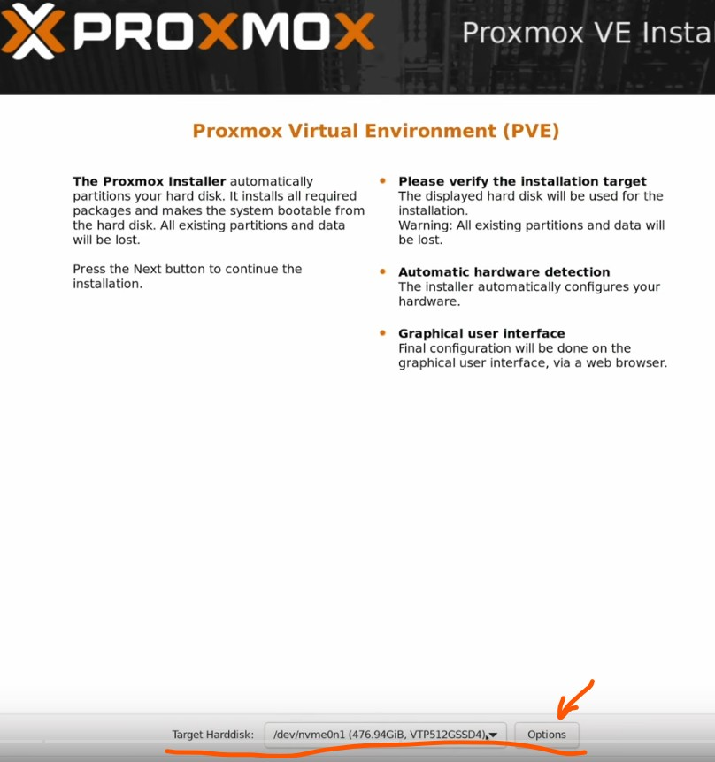
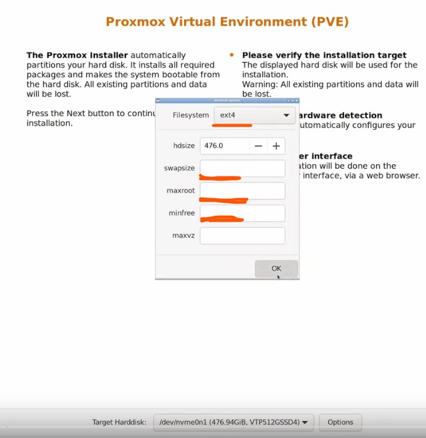

# :fontawesome-brands-linux: Proxmox VE installation

Dieser Artikel beinhaltet eine Anleitung zu Installation und Einrichtung von [`Proxmox VE`][Proxmox VE]{target=\_blank}[^1]

[Proxmox VE]: https://de.wikipedia.org/wiki/Proxmox_VE

Proxmox Virtual Environment ist eine komplette Open Source-Virtualisierungsplattform für Server. Es kombiniert KVM- und Container-basierte Virtualisierung und verwaltet virtuelle Maschinen, Container, Storage, virtuelle Netzwerke und Hochverfügbarkeits-Cluster übersichtlich über die zentrale Managementoberfläche.

---

> [!NOTE]
>
> Proxmox VE stellt zwei Virtualisierungstechnologien auf einer Plattform bereit
> Dies bietet maximale Flexibilität für die virtualisierte IT-Infrastruktur
> Verwenden Sie KVM für virtuelle Maschinen und Container für leichtgewichtige Linux-Anwendungen

---

##### USB-Stck für die Installation von Proxmox VE vorbereiten

??? tip "USB-Stck vorbereiten"

    Porxmox VE ISO Installer kann man von [hier]{target=\_blank} downloaden. <br>
    Mit dem Tool [`Ventoy`][Ventoy]{target=\_blank}[^2] bereitet man den USB-Stick wie folgt vor:

    - Den leeren USB-Stick in ein Windows Rechner einstecken

    - Ventoy App starten, USB-Stick aus Dropdown-Liste wählen und auf `Install` klicken

    - Ein Ordner `tools` erstellen und die ISO-Datei in den Ordner kopieren

[hier]: https://www.proxmox.com/en/downloads
[Ventoy]: https://ventoy.net/en/download.html

##### Proxmox VE installieren

??? tip "Proxmox VE auf neuer Hardware installieren"
    
    USB-Stick ad die neue Hardware anschliessen und den Server starten. Über die Taste `F12` komt man ins `BIOS` und nimmt die notwendigen Einstellungen vor.  
    Auch hier kommt man ins BIOS vom `RAID-Controller`. Wir haben drei 4TB Festplatten an diesem RAID-Controller angeschlossen. Es wird ein `RAID1` mit einer `Hot-Spare-Festplatte` erstellt. Darauf wird Proxmox VE installiert.

    Über die Taste F11 (Supermicro Mainmoard) kommt man ins Boot-Menü und wählt den Boot von USB-Stick.
    Es erscheint kurz danach ein Menü und man wählt `Install Proxmox VE (Graphical)` aus. Die Installation von Proxmox VE wird von einem Installationsassistent begleitet.
    
    Als `Filesysten` wählt man `ext4` und als `Target Hardisk` `sda` und klickt auf die Taste `Options`
    {width=700} 

    Im nächste Fenster nehmen wir folgende Einstellungen vor:
 
    ```
    swapsize: 16GB  - Die Größe der `SWAP` Partition 
    maxroot:  70GB  - Die Größe der `root` Partition
    minfree:  16GB  - Freier Platz für LVM Snapshots

    ```
    {width=700}

    Der Installationsassistent erstellt drei Partitonen: sda1=boot, sda2=UEFI und sda3=Linux LVM. Es werden drei LVs gemäß unseren Angaben angelegt: `LV Name: root` 70GB; `LV Name: swap` 16GB; 16GB werden frei gelassen und `LV Name: data` der Rest des Speicherplatzes als `Lokales Storage`. Nach der Installation über den Befehl `lvdisplay` kann man sich die Partitionierung genau anschauen.

    Wenn im Server mehrere Netzwerkkarten installiert sind, dann wird die aktive Netzwerkkarte mit einem grünen Punkt gekennzeichnet. Nach der erfolgreichen Installation startet der Server neu und es wird die URL angezeigt, über die man das Webinterface erreichen kann. 

##### Proxmox VE Netzwerk einrichten

??? tip "Netzwerk einrichten"


[^1]: [Proxmox VE Homepage](https://www.proxmox.com/de/){target=\_blank}
[^2]: [Ventoy Homepage](https://ventoy.net/en/index.html){target=\_blank}

