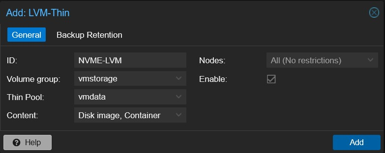

# :fontawesome-brands-linux: Proxmox VE - Software RAID einrichten

Dieser Artikel beinhaltet eine Anleitung zur Einrichtung von Software RAID [`MDADM`][MDADM]{target=\_blank}[^2] unter [`Proxmox VE`][Proxmox VE]{target=\_blank}[^1]

Als `Storage` für die VMs wird ein [`RAID1`][RAID1]{target=\_blank} aus zwei `Enterprise-SSDs` [`KIOXIA`][KIOXIA]{target=\_blank}[^3] 3.2TB erstellt. Danach wird ein [`LVM`][LVM]{target=\_blank} [`thin pool`][thin pool]{target=\_blank} auf dem `RAID1` erstellt.

##### Enterprise-SSDs

??? tip "Enterprise-SSDs anzeigen lassen"

    Einige Befehle um die SSDs anzeigen lassen:

    ```bash
    dmesg |grep nvme
    ----
    [    2.952994] nvme nvme1: pci function 0000:9c:00.0
    [    2.953160] nvme nvme0: pci function 0000:9b:00.0
    -----

    lspci -v |grep KIOXIA
    ----
    9b:00.0 Non-Volatile memory controller: KIOXIA Corporation NVMe SSD Controller CD8 (rev 01) (prog-if 02 [NVM Express])
            Subsystem: KIOXIA Corporation NVMe SSD Controller CD8
    9c:00.0 Non-Volatile memory controller: KIOXIA Corporation NVMe SSD Controller CD8 (rev 01) (prog-if 02 [NVM Express])
            Subsystem: KIOXIA Corporation NVMe SSD Controller CD8
    ----

    lsblk
    ----
    ...
    nvme0n1            259:0    0  2.9T  0 disk
    nvme1n1            259:1    0  2.9T  0 disk
    ----
    ```
##### RAID1 einrichten

??? tip "Software MDADM installieren und RAID1 einrichten"

    - Software MDADM installieren und RAID1 erstellen

    ```bash
    # mdadm installieren
    apt-get install mdadm -y

    # Create mdadm raid1: md0
    mdadm --create --verbose /dev/md0 --level=1 --raid-devices=2 /dev/nvme0n1 /dev/nvme1n1

    # Show result
    cat /proc/mdstat
    # oder
    mdadm -D /dev/md0

    ```

    !!! info "Note"

        Man kann den Synchronisierungsstatus mit Hilfe von `screen` und `watch` viel besser im Auge behalten

        ```bash
        # screen install
        apt-get install screen

        # Screen starten: mdadm ist der Name von screen Session
        screen -S mdadm
            
        # Synchronisierungsstatus alle 30 sec aktualisieren
        watch -n 30 cat /proc/mdstat

        watch -n 30 mdadm -D /dev/md0
        ```

    - Neue Partition auf dem gesamten Raid Volume erstellen

    ```bash
    # A num value of 0 causes the program to use the first available partition number
    sgdisk -N=0 /dev/md0 
     
    ```
    - Das gesamte Raid für LVM als Phyisical Volume (PV) vorbereiten, wobei -ff = force und -y=alles mit Ja beantworten bedeutet, metadatasize is LVM2 default mit 512Byte:

    ```bash
    pvcreate -y -ff /dev/md0

    # Wenn diese Meldung kommt: Cannot use /dev/md0: device is partitioned, dann 
    wipefs -a /dev/md0

    # Status anzeigen
    pvs
    pvdisplay

    # Jetzt wird die Volume Group (VG) mit dem Namen "vmstorage" über das Raid erstellt:
    vgcreate vmstorage /dev/md0

    # Status anzeigen
    pvdisplay
    vgdisplay

    # Nun kann das logische Volumen (LV) über die gesamte Größe der VG "vmstorage" mit dem Namen der LV "vmdata" erstellt werden (-l=Größe, -T=thin, -n=Name)
    # Wir benutzen 95% der Größe
    lvcreate -l95%FREE -T -n vmdata vmstorage

    # When using LVM thin provisioning you're looking for the left-most attribute bit to be V, t or T. Here's an example:
    lvs
    ----
      LV     VG        Attr       LSize  Pool Origin Data%  Meta%  Move Log Cpy%Sync Convert
      data   pve       twi-a-tz--  3.50t             0.00   0.19
      root   pve       -wi-ao---- 80.00g
      swap   pve       -wi-ao----  8.00g
      vmdata vmstorage twi-a-tz-- <1.31t             0.00   10.44
    ----

    # Nun erfolgt die Konvertierung in ein LVM Thin:
    # lvconvert --type thin-pool vmstorage/vmdata

    ```

    !!! info "Note"

        Man kann auch ein **LVM**-Volume in ein **LVM**-Thin Volume nachträglich konventieren  I

        ```bash
        lvconvert --type thin-pool vmstorage/vmdata

        ```

##### LVM-Thin Storage 

??? tip "LVM Thin in der Proxmox VE WebGUI als Storage einrichten"

    - Anmeldung über Proxmox VE WebGUI

    - Unter Rechenzentrum -> Storage -> Button "Hinzufügen" -> "LVM thin" klicken
    
    - Form wie auf dem Bild unten ausführen

    {width=500}

    - Die Konfiguration wird in der Datei `/etc/pve/storage.cfg` gespeichert

    ```bash
    # cat /etc/pve/storage.cfg 
    ----
    ...
    lvmthin: NVME-LVM
             thinpool vmdata
             vgname vmstorage
             content images,rootdir
    ----
    ```

[Proxmox VE]: https://de.wikipedia.org/wiki/Proxmox_VE
[MDADM]: https://de.wikipedia.org/wiki/Mdadm
[RAID1]: https://de.wikipedia.org/wiki/RAID#RAID_1:_Mirroring_%E2%80%93_Spiegelung 
[KIOXIA]: https://en.wikipedia.org/wiki/Kioxia
[LVM]: https://de.wikipedia.org/wiki/Logical_Volume_Manager
[thin pool]: https://pve.proxmox.com/wiki/Storage:_LVM_Thin

[^1]: [Proxmox VE Homepage](https://www.proxmox.com/de/){target=\_blank}
[^2]: [MDADM RAID](https://de.wikipedia.org/wiki/Mdadm){target=\_blank}
[^3]: [KIOXIA KCD8XVUG3T20](https://europe.kioxia.com/de-de/business/ssd/data-center-ssd/cd8-v.html){target=\_blank}
